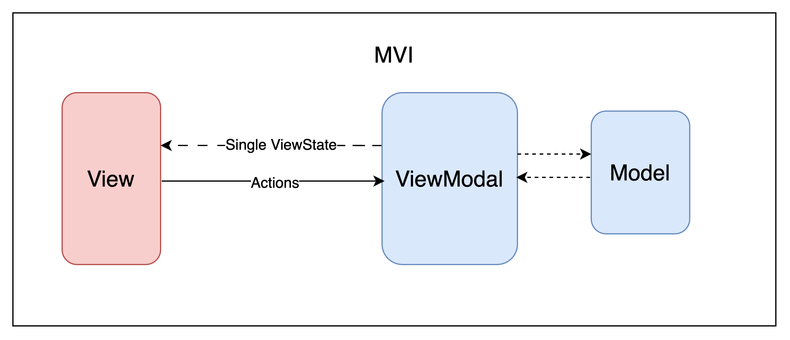

### About

This Android app leverages several **Android Architect Component** to build a modern, maintainable, and testable application. Below is the components used:
- Jetpack Compose.
- lifecycle.
- DataStore.
- Paging
- Navigation
- Hilt
- ViewModel

**Also Add Unit Test and BDD Test.**

### Instruction

| Action              | Command                                                         |
| --------------------- | ----------------------------------------------------------------- |
| Build Debug APK     | `./gradlew :app:assembleDebug`                              |
| Install & Run App   | `./gradlew :app:installDebug  |
| Run Unit Tests      | `./gradlew :app:testDebugUnitTest --info`                   |
| Open Test Report    | `open app/build/reports/tests/testDebugUnitTest/index.html` |
| Run BDD Tests  | `./gradlew :app:jacocoTestReport`                           |

### UML



### APK
[Download APK](./apk/app-debug.apk)


**Note：** You need to configure the local.properties file in the project root directory, and input the Github client_id and client_secret that you applied for.
```text
ndk.dir="xxxxxxxx"
CLIENT_ID = "xxxxxx" // "8ee22ef5ebf999414290"  
CLIENT_SECRET = "xxxxxx"  //"035003fb29ac11bede38818ea02b9ca17f7371fc"
```

